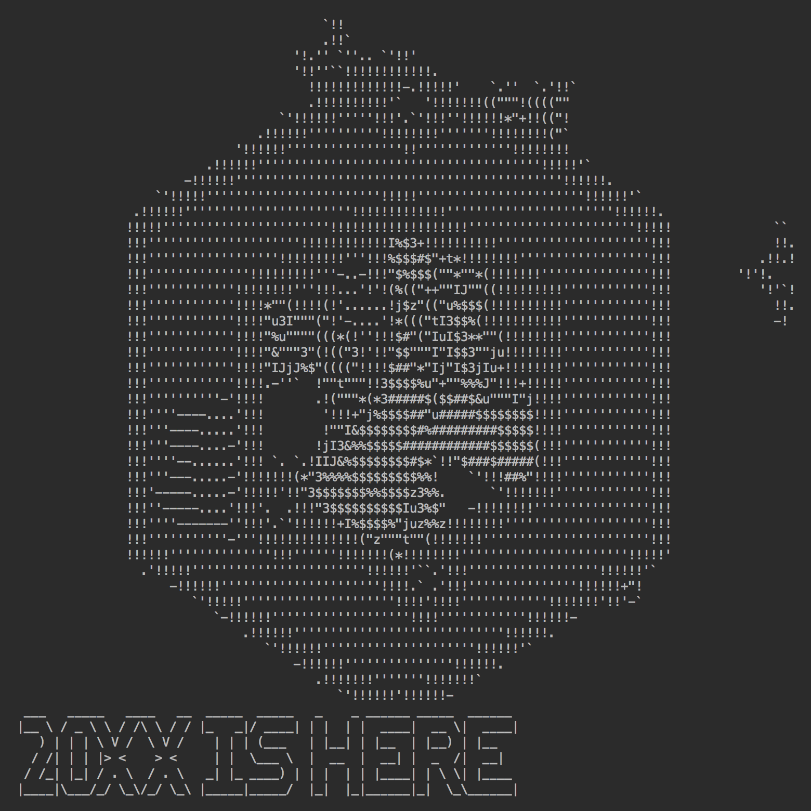
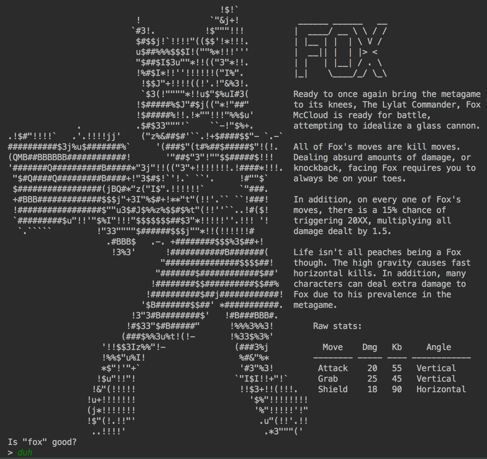

# ROCK PAPER SMASH


# FAST STARTUP

I don't care how it works, just let me play the damn game.

Make sure you have Java installed.

Download [RPS](https://github.com/DarrienG/RockPaperSmash/releases/download/1.3/RPS.zip). Open a terminal full screen. Unzip RPS and then type:

```
cd RPS
java -jar RPS.java
```


# Introduction

Rock Paper Smash is a fighting game that pushes the rock, paper, scissors meta of the Super Smash Brother series to forefront.

In standard Smash Bros. a player has three main options: attack, shield, and grab. While there are lots of other things you can do, these are the three main categories.

In Rock Paper Smash the idea is the same, you have the three same options: attack, shield, and grab. Attack when the opponent shields, and you get punished, shield when your opponent grabs and get grabbed, grab when your opponent attacks, and you get hit. Simple, right?



# Setup                                  

Got Java? No? Then go get it and come back.

Click on *Releases* in the top bar, and download the zip that'll probably be called RPS.zip.

Extract all of the files from the archive.

Since I wrote this when I didn't know how to make a GUI and UMass Lowell only teaches commandline programs, this only works in a commandline. Welcome back to the 1980s. Open terminal if you're on Linux or OS X, or Command if you're on Windows.

Navigate to the directory you unzipped in your command prompt.

Maximize your terminal to get the full viewing experience 😎

Finally, type this command:

    java -jar RPS.jar



# Troubleshooting

## I'm on Windows, why does everything look weird?

Fight me Bill Gates. Windows uses a weird font for the terminal. Change it to something more standard to make it look better.

    1. Right click on the top bar
    2. Click on properties
    3. Click on Font
    4. Choose a smaller size for your current font
    5. Hit OK

## Heeeelp everything doesn't fit on my screen

Go to your terminal settings, and make the font smaller. ✅

# Contributing

WE FINALLY have a build system, so this is now contributable.

If you want to add characters, check out understand.txt in src/main/resources/stats/understand.txt

It'll give you the scoop on the garbage file format I wrote years ago and how it works.

If you want contribute to the code, it's kind of the worst so good luck.
Honestly it's the worst and was written years ago by me. It was "refactored"
recently so that it will work in jars and the like, but that doesn't mean it's
good.

Happy to have contributions though :)

building:

```
./gradlew build
```

Beautiful. To distribute your own version, use `./gradlew distZip`
